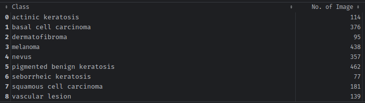
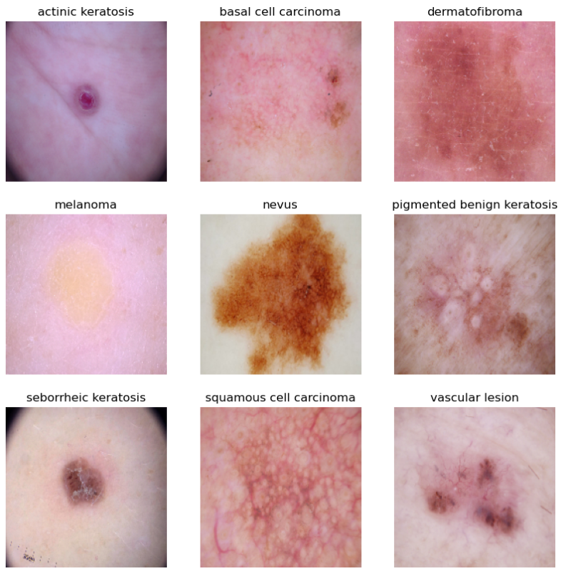
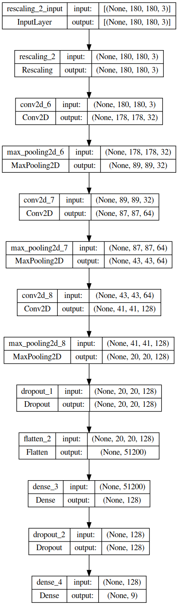
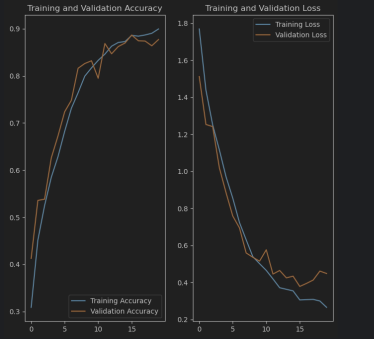

# Melanoma classification
> In this assignment, you will build a multiclass classification model using a custom convolutional neural network in TensorFlow.


## Table of Contents
* [General Info](#general-information)
* [Technologies Used](#technologies-used)
* [Conclusions](#conclusions)
* [Acknowledgements](#acknowledgements)

<!-- You can include any other section that is pertinent to your problem -->

## General Information
- Melanoma is a type of cancer that can be deadly if not detected early
- A solution that can evaluate images and alert dermatologists about the presence of melanoma has the potential to reduce a lot of manual effort needed in diagnosis

**Problem statement**: 
To build a CNN based model which can accurately detect melanoma. Melanoma is a type of cancer that can be deadly if not detected early. It accounts for 75% of skin cancer deaths. A solution which can evaluate images and alert the dermatologists about the presence of melanoma has the potential to reduce a lot of manual effort needed in diagnosis.

## Dataset

The dataset consists of 2357 images of malignant and benign oncological diseases, which were formed from the International Skin Imaging Collaboration (ISIC). All images were sorted according to the classification taken with ISIC, and all subsets were divided into the same number of images, with the exception of melanomas and moles, whose images are slightly dominant

The data set contains the following skin disorders:



### Sample


## CNN Architecture Design

- **Rescaling Layers** - To rescale an input in the [0, 255] range to be in the [0, 1] range.
- **Convolutional Layer** - The objective of the Convolution Operation is to extract the high-level features such as edges, from the input image
- **Pooling Layer** - Pooling layer is responsible for reducing the spatial size of the Convolved Feature. This is to decrease the computational power required to process the data through dimensionality reduction
- **Dropout Layer** - Designed to prevent overfitting and improve the generalization of the model by randomly drops out (sets to zero) a certain percentage of the input units of the layer during training 
- **Flatten Layer** - Used to convert a multi-dimensional input tensor into a one-dimensional output tensor. The Flatten layer is commonly used in convolutional neural networks (CNNs) for image classification tasks, where the input data is usually a 3D tensor of shape
- **Dense Layer** - Dense layer is a type of layer where all the neurons are connected to every neuron in the previous layer, forming a fully connected network
- **Activation Function(ReLU)**

 > model.add(layers.Dense(128, activation='relu'))
   
  The above dense layer uses an activation function RELU and introduces non-linearity into the output of a neural network

- **Activation Function(Softmax)**

 > model.add(layers.Dense(len(class_names), activation='softmax'))

  Softmax is an activation function commonly used in the output layer of neural networks for multiclass classification tasks

### Model Architecture



## Output



Was able to achieve training accuracy: 89.95% - validation accuracy: 87.71%

The model was able to correctly classify Melanoma

```shell
1/1 [==============================] - 0s 14ms/step
Actual Class nevus
Predictive Class nevus
1/1 [==============================] - 0s 53ms/step
Actual Class melanoma
Predictive Class melanoma
```

## Technologies Used
- 

## Acknowledgements
Give credit here.
- This project was inspired by...
- References if any...
- This project was based on [this tutorial](https://www.example.com).


## Contact
Created by [@jtkSource] - feel free to contact me!
